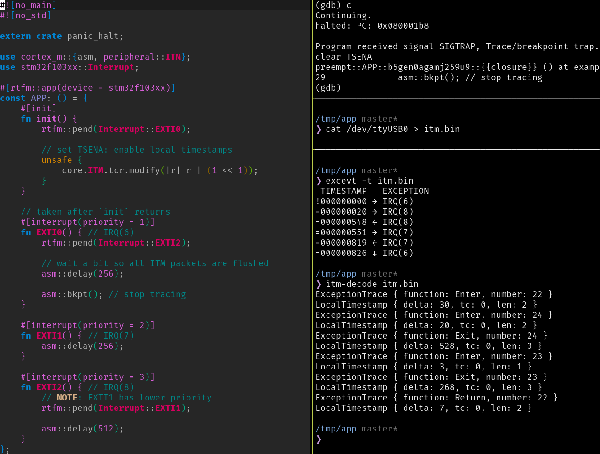
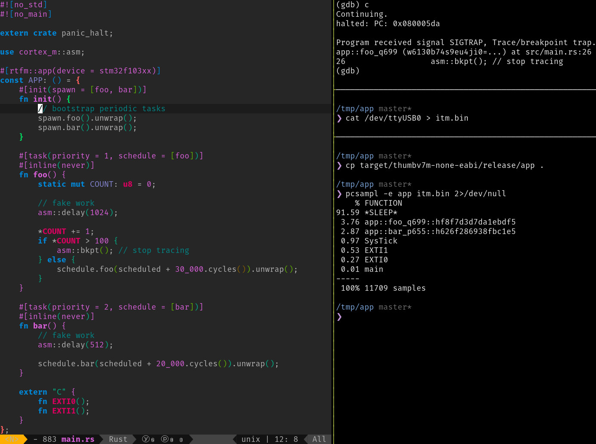

# `itm-tools`

> Tools for analyzing ITM traces.

<p align="center">

<br>
<em>Tracing interrupt handling</em>
</p>

This set of tools currently supports:

- [Exception tracing](#exception-tracing), via `excevt`
- [PC sampling](#pc-sampling), via `pcsampl`, and
- [Port demuxing](#port-demuxing), via `port-demux`

**NOTE:** These tools have been designed to deal with ITM traces that contain
only few different, but related, packet types. If your ITM traces contain
timestamps, PC sampling, instrumentation, exception trace and other kind of
packets, all intermixed, then these tools won't work for you. In practice,
though, it's likely that you'll only trace one aspect at a time due to the
bandwidth limit of the ITM output.

## Exception tracing

The ITM can generate an exception trace packet any time the processor enters,
leaves or returns from an interrupt. Timestamp packets can be attached to these
packets. This information can be used to trace interrupt prioritization and
measure the execution time of interrupt handlers. `excevt` simplifies the
analysis and visualization of this information.

To configure the ITM for exception tracing you can add the following commands
to your GDB script. Alternatively, you can configure the ITM peripheral from
the application.

``` console
$ tail openocd.gdb
# NOTE: pick ONE of these (see cortex-m-quickstart for more details)
# monitor tpiu config internal itm.bin uart off 8000000
monitor tpiu config external uart off 8000000 2000000

# set EXCEVTENA; clear PCSAMPLENA
monitor mmw 0xE0001000 65536 4096

# on the STM32F1 the timestamp counter will not stop when the processor is
# halted. This results in timestamp packets being emitted when the processor is
# halted. So we disable timestamping when halting the processor from the
# debugger (e.g. # bkpt)
define hook-stop
  echo clear TSENA\n
  monitor mmw 0xE0000E80 0 2
end
```

**NOTE:** In practice, you should not mix debugging and tracing as the debugger
will interfere with timestamps and other event counters -- this is ARM's
recommendation. We mix them here because that makes the tools easier to try out
and these are just examples.

Here's an example [RTFM] application that features a few interrupt handlers that
preempt each other.

[RTFM]: https://crates.io/crates/cortex-m-rtfm

``` rust
#[rtfm::app(device = stm32f103xx)]
const APP: () = {
    #[init]
    fn init() {
        rtfm::pend(Interrupt::EXTI0);

        // set TSENA: enable local timestamps
        unsafe {
            core.ITM.tcr.modify(|r| r | (1 << 1));
        }
    }

    // taken after `init` returns
    #[interrupt(priority = 1)]
    fn EXTI0() { // IRQ(6)
        rtfm::pend(Interrupt::EXTI2);

        // wait a bit so all ITM packets are flushed
        asm::delay(256);

        asm::bkpt(); // stop tracing
    }

    #[interrupt(priority = 2)]
    fn EXTI1() { // IRQ(7)
        asm::delay(256);
    }

    #[interrupt(priority = 3)]
    fn EXTI2() { // IRQ(8)
        // NOTE: EXTI1 has lower priority
        rtfm::pend(Interrupt::EXTI1);

        asm::delay(512);
    }
};
```

Collecting ITM traces from this application,


``` console
$ # collect ITM data
$ cat /dev/ttyUSB0 > itm.bin
```

``` console
$ # on another terminal: run program to `asm::bkpt`
$ cargo run --release
```

Produces these packets:

``` console
$ itm-decode itm.bin
ExceptionTrace { function: Enter, number: 22 }
LocalTimestamp { delta: 30, tc: 0, len: 2 }
ExceptionTrace { function: Enter, number: 24 }
LocalTimestamp { delta: 20, tc: 0, len: 2 }
ExceptionTrace { function: Exit, number: 24 }
LocalTimestamp { delta: 528, tc: 0, len: 3 }
ExceptionTrace { function: Enter, number: 23 }
LocalTimestamp { delta: 3, tc: 0, len: 1 }
ExceptionTrace { function: Exit, number: 23 }
LocalTimestamp { delta: 268, tc: 0, len: 3 }
ExceptionTrace { function: Return, number: 22 }
LocalTimestamp { delta: 7, tc: 0, len: 2 }
```

Which can be better visualized using the `excevt` tool:

``` console
$ excevt -t itm.bin
!000000000 → IRQ(6)
=000000020 → IRQ(8)
=000000548 ← IRQ(8)
=000000551 → IRQ(7)
=000000819 ← IRQ(7)
=000000826 ↓ IRQ(6)
```

The left column shows the timestamp of the events. `=` means a precise
timestamp, `<` means that the event occurred before the reported timestamp and
`!` means that the counter was reset due to packet loss.

The arrows on the second column indicate whether the processor entered the
interrupt (`→`), left the interrupt (`←`) or returned to the interrupt handler
(`↓`).

The last column indicates the interrupt, or exception, associated to the event.
`IRQ(n)` means a device specific interrupt. For Cortex-M exceptions you'll see
the standard name, for example `SysTick`. Finally, you may also see the word
`Thread`, which indicates *thread mode* (that is not servicing any interrupt or
exception).

`excevt` also works when timestamps are disabled. For example, if you comment
out the setting `TSENA` in the above example and re-run the program, you'll get
these outputs from `itm-decode` and `excevt`:

``` console
$ itm-decode itm.bin
ExceptionTrace { function: Enter, number: 22 }
ExceptionTrace { function: Enter, number: 24 }
ExceptionTrace { function: Exit, number: 24 }
ExceptionTrace { function: Enter, number: 23 }
ExceptionTrace { function: Exit, number: 23 }
ExceptionTrace { function: Return, number: 22 }
```

``` console
$ excevt itm.bin
 ????????? → IRQ(6)
 ????????? → IRQ(8)
 ????????? ← IRQ(8)
 ????????? → IRQ(7)
 ????????? ← IRQ(7)
 ????????? ↓ IRQ(6)
```

## PC sampling

<p align="center">

<br>
<em>Profiling firmware</em>
</p>


The ITM can also be configured to output periodic packets that contain snapshots
of the program counter. These can be used to answer the question: where is my
program spending most of its time? `pcsampl` can process the data and answer
this question.

To configure the ITM for periodic PC sampling you can add the following commands
to your GDB script.

``` console
$ tail openocd.gdb
# NOTE: pick ONE of these (see cortex-m-quickstart for more details)
# monitor tpiu config internal itm.bin uart off 8000000
monitor tpiu config external uart off 8000000 2000000

echo clear EXCEVTENA; set PCSAMPLENA\n
monitor mmw 0xE0001000 4096 65536
echo enable CYCCNT; set POSTINIT / POSTRESET to 3\n
monitor mmw 0xE0001000 103 510
```

Here's an example RTFM application that runs two periodic tasks and sleeps when
none of the tasks is active.

``` rust
#[rtfm::app(device = stm32f103xx)]
const APP: () = {
    #[init(spawn = [foo, bar])]
    fn init() {
        // bootstrap periodic tasks
        spawn.foo().unwrap();
        spawn.bar().unwrap();
    }

    #[task(priority = 1, schedule = [foo])]
    #[inline(never)]
    fn foo() {
        static mut COUNT: u8 = 0;

        // fake work
        asm::delay(1024);

        *COUNT += 1;
        if *COUNT > 100 {
            asm::bkpt(); // stop tracing
        } else {
            schedule.foo(scheduled + 30_000.cycles()).unwrap();
        }
    }

    #[task(priority = 2, schedule = [bar])]
    #[inline(never)]
    fn bar() {
        // fake work
        asm::delay(512);

        schedule.bar(scheduled + 20_000.cycles()).unwrap();
    }

    extern "C" {
        fn EXTI0();
        fn EXTI1();
    }
};
```

Collecting the ITM packets produces a few kilobytes of data:

``` console
$ itm-decode itm.bin 2>/dev/null | wc
  11714   58591  362321
```

This information can be summarized using the `pcsampl` tool:

``` console
$ pcsampl -e target/thumbv7m-none-eabi/release/app itm.bin 2>/dev/null
    % FUNCTION
91.69 *SLEEP*
 3.70 app::foo_o7xa::h9e4953f3ea6a58d8
 2.87 app::bar_t7fm::hf544b1b6f026d266
 0.95 SysTick
 0.52 EXTI1
 0.26 EXTI0
 0.01 main
-----
 100% 11692 samples
```

The percentage of time spent sleeping is always displayed first. Afterwards, the
percentage of time spent in other functions is reported, in descending order.

## Port demuxing

The ITM lets the software send instrumentation packets. These packets carry a
stimulus port number which the application can use to mux different sources of
information into a single stream of data. Naturally, the receiver must demux
this data back into the original streams. `port-demux` provides such
functionality.

To enable port muxing of instrumentation packets you can add the following
commands to your GDB script.

``` console
$ tail openocd.gdb
# NOTE: pick ONE of these (see cortex-m-quickstart for more details)
# monitor tpiu config internal itm.bin uart off 8000000
monitor tpiu config external uart off 8000000 2000000

# enable ITM ports
monitor itm port 0 on
monitor itm port 1 on
monitor itm port 2 on

# use this if you used any of the other GDB script snippets
echo clear EXCEVTENA and PCSAMPLENA\n
monitor mmw 0xE0001000 0 69632
```

Here's a `cortex-m-rt` application that reports data using three different
stimulus ports.

``` rust
#[entry]
fn main() -> ! {
    let mut p = cortex_m::Peripherals::take().unwrap();

    iprint!(&mut p.ITM.stim[0], "Hell");

    // imagine this interrupts the port 0 write
    iprint!(&mut p.ITM.stim[1], "The ");

    // imagine this interrupts the port 1 write
    iprintln!(&mut p.ITM.stim[2], "The answer is 42");

    // resume port 1 write
    iprintln!(
        &mut p.ITM.stim[1],
        "quick brown fox jumps over the lazy dog"
    );

    // resume port 0 write
    iprintln!(&mut p.ITM.stim[0], "o, world!");

    asm::bkpt();

    loop {}
}
```

You can set up `port-demux` to demux the stream of data as it's received.

``` console
$ cat /dev/ttyUSB0 | port-demux -f
```

And then watch over the demuxed streams

``` console
$ # on another terminal
$ tail -f 0.stim
Hello, world!
```

``` console
$ # on another terminal
$ tail -f 1.stim
The quick brown fox jumps over the lazy dog
```

``` console
$ # on another terminal
$ tail -f 2.stim
The answer is 42
```

## License

The code in this repository is distributed under the terms of both the MIT
license and the Apache License (Version 2.0).

See [LICENSE-APACHE](LICENSE-APACHE) and [LICENSE-MIT](LICENSE-MIT) for details.
